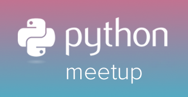

 
## Бот для организации и проведения мероприятий

## Переменные окружения
- **DEBUG** - по умолчанию `False`
- **ALLOWED_HOSTS** - по умолчанию `['localhost', '127.0.0.1']`
- **TG_TOKEN** - токен телеграмм бота
- **EVENTS_URL** - ссылка на админку, по умолчанию http://127.0.0.1:8000/admin/

## Запуск
- Запустите админку `python manage.py runserver <host:port>`
- Запустите бота `python manage.py start_bot`
- Запустите сервис оповещений `python manage.py notify_service` 